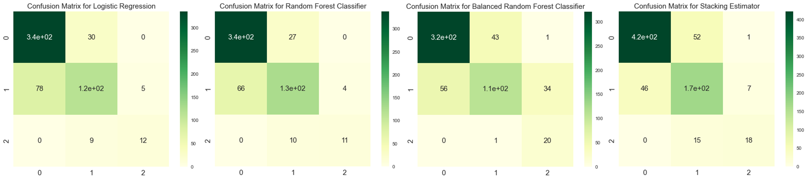
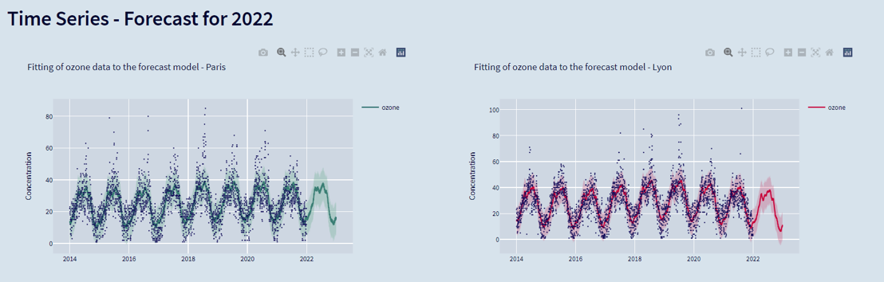

# Final Project | Air Quality Paris vs. Lyon

*[Radoslaw Debek]*

*[Data Analytics, Paris, 11.02.2022]*

## Content

- [Final Project | Air Quality Paris vs. Lyon](#final-project--air-quality-paris-vs-lyon)
  - [Content](#content)
  - [Project Description](#project-description)
  - [Workflow](#workflow)
  - [01 - Data Collection](#01---data-collection)
    - [Weather](#weather)
    - [Air Quality](#air-quality)
  - [02 - Data Loading](#02---data-loading)
  - [03 - Data Selection](#03---data-selection)
  - [04 - Data Cleaning](#04---data-cleaning)
    - [Cleaning for Time Series Analysis and EDA](#cleaning-for-time-series-analysis-and-eda)
    - [Cleaning for Supervised ML and EDA](#cleaning-for-supervised-ml-and-eda)
  - [05 - Time Series](#05---time-series)
  - [06 - Machine Learning](#06---machine-learning)
    - [Results](#results)
      - [Paris](#paris)
      - [Lyon](#lyon)
  - [07 - EDA](#07---eda)
  - [08 - Streamlit Dashboard](#08---streamlit-dashboard)
      - [Deploying to Heroku](#deploying-to-heroku)
  - [Conclusions](#conclusions)
  - [Links](#links)

## Project Description

Air quality forecast in Paris and Lyon

Business problem: Forecast of air quality in Paris and Lyon in coming months basing on the historical data (period from 2014 till the end of 2021).

The two approaches were used in the project. Time series analysis of 4 pollutants pm2.5, pm10, NO2 and O3.
Machine learning in order to predict the airquality on a specific day given the weather conditions and month.

## Workflow

1. Building a database with the historical data on air quality and weather conditions for the selected cities in Europe.
    1.1. Data Collection:
    - air pollution data: <https://aqicn.org/>
    - weather data: <https://visualcrossing.com/>
    1.2. Loading data into the database:
    - formating of the files
    - adding data into SQL database
2. Data Selection:
   - selection of the data for a specific city (i.e. Paris)
   - writing a SQL query and importing the data back into Python
3. Data Cleaning and Processig
   - cleaning and processing of data for Time Series Analysis
   - cleaning and processing of data for Machine Learning
4. Time Series Analysis
5. Machine Learning
6. Models testing.
7. Comparison of air pollution in Paris with different cities in Europe.
8. Creating Dashboard.
9. Preparing deliverables (readme file, Git-Hub repository, presenation).

## 01 - Data Collection

### Weather

The weather data was collected using <https://visualcrossing.com/>.  
They provide a great API allowing to retrieve historical data from different location.  
The free API key allows to retrieve 1000 records per day.  
So I split the work for each cities and years I was interested in.  
I wrote a python script to perform the requests to the API and save the result as JSON file for future use.

*Using : python, requests*

### Air Quality

The air quality data was retrieved from <https://aqicn.org/> and more specificaly from <https://aqicn.org/data-platform/covid19/> where they provide (in csv format) historical data for the last couple of years for several cities.

They also have an API but the current documentation was not showing any means to retrieve historical data.

So the CSV files were downloaded through python script.

*Using : python, requests*

## 02 - Data Loading

In order to store the raw data gathered in the previous step and easily retrieve it, I created a MySQL database to store both sources in two tables (weather and airquality).

To create a database, I firstly created a python script with engine which allowed me to communicate between Python and MySQL (Subfolder 00-Utils).

In the next step, I prepared two python files which create tables ready to store air pollution and weater data in the MySQL database. 

Finally, I prepared two other python scripts, thanks to which it is possible to load the data into MySQL database. This process can be easily repeated, when new data files are collected.  

*Using : sql, python, pandas, sqlalchemy*

## 03 - Data Selection

In the created database data for air quality and weather for various cities were stored in different Tables. By writing simple SQL query I am able to connect to the database and select the data (both air quality and weather) for a desired city. The selected data is saved in cvs file which is ready for further analysis.

The detailed description of what information are present in the created file regarding both air quality and weather conditions can be found in the file: <variables_description.md>

The approach presented in steps 01-03, allowed me to create an easy-to-use method for creating a file with both weather and air pollution information for a desired city. In this project two selected cities in France were compared: Paris and Lyon. However, as the database contains information as well for other locations in Europe, it is easy to repeat this process for any other city.


*Using : sql, python, pandas, sqlalchemy, glob, os*

## 04 - Data Cleaning

The selected data for two cities Paris and Lyon, where cleaned and processed before Time Series and Supervised Machine Learning Analysis. This process was divided into two parts, as for Time Series Analysis only the data for Air Pollution was needed, while for building the Supervised Learning Model was more focused on the weather data.

### Cleaning for Time Series Analysis and EDA

The columns which presented relevant information for Time Series analysis were the columns containing the air pollution and date information, i.e. : 'datetime', 'pm25', 'pm10', 'o3', 'no2', 'so2' and 'co'.

The process of data cleaning and processing included:

- converting datetime column into datetime type.
- missing values processing:
  - columns 'so2' and 'co' were deleted due to the high number of missing values
  - separate missing values were replaced by the average values of each pollutant for the specified month and year.
  - for Paris there was a period of 3 months of missing data in 2017. In this case I decided to input the missing values of each day and each pollutant as an average of these values in 2016 and 2018.
  - for Lyon there was a period of 6 months missing in the second half of 2021. Fortunately, these values, were presented in the other csv file at the air quality data source. Therefore, I imputed the missing values from the different file.
- Outliers. In order to check for outliers, I draw a boxplot graph for each pollutant. Basing on that visual representation of the data I could state that there were no outliers in data recorded both in Paris and Lyon.

### Cleaning for Supervised ML and EDA

The aim of second stage of cleaning was to prepare the data for Supervised Machine Learning and EDA. This process included:

- exchanging columns with information about air quality for the clean ones from the previous stage of cleaning
- changing date type to datetime 
- dropping columns 'latitude', 'longitude', 'address', 'datetimeEpoch', 'description' as they contain wither the same information or too various information, so they are not useful for machine learning model
- Missing values processing:
  - columns 'snow', 'snowdepth', 'solarradiation', and 'solarenergy' were dropped due to the high number of missing values.
  - 1 missing value for precipitation was filled with 0, as from other columns it was clear that it did not rain that day.
  - 'windgust' contained 1 missing value and it was dropped due to the high correlation with windspeed column
  - 1 missing value of pressure was filled with the value from the proceeding day as it presented similar weather conditions.
- 'Conditions' column needed encoding as it was the only categorical column. The column was encoded by creating columns with 0/1 values for each weather condition.
- New columns containing information about month and day of the week were created, as they might be useful for ML model. After that column with date information was dropped.
- The data was checked for collinearity between columns. The correlation matrix was created and one by one columns with the correlation above 90% were dropped. This included: 'tempmax', 'tempmin' (high correlation to 'temp').
- Outliers. The boxplot for numerical columns were drawn. Basing on this visual representation I can conclude that all of the values are in the reasonable range and there were no outliers.
- Column with a target variable was created basing on the recorded values of PM2.5 concentration. This pollutant is often used as an air quality indicator as its concentration is related to the concentration of other pollutants. Therefore, I created three classes basing on the values of PM2.5:
  - Class 0: day with good air quality, PM2.5 concentration below 50 µg/m³.
  - Class 1: day with moderate air quality, PM2.5 concentration between 50 and 100 µg/m³.
  - Class 2: day with bad air quality, PM concentration above 100 µg/m³.
- After creating the target column, the columns with the concentration of pollutants ('pm25', 'pm10', 'o3' and 'no2') were dropped, but this was done before ML, as they were also used for EDA.

The cleaned data ready for Time Series and ML was saved in the separate files.

*Using : python, pandas, numpy, matplotlib, seaborn*

## 05 - Time Series

Time Series Analysis was performed separately for each pollutant (PM2.5, PM10, ozone and nitrogen dioxide) in each city.
The analysis included:

- Stationarity test - all analysed time series data was stationary.
- Autocorrelation check - graphs showing autocorrelation and partial autocorrelation were drawn for each pollutant. These graphs pointed that there is similarity between values for high number of lags.
- Decomposition to see trend line.
- Train/test split in proportion 80/20 to evaluate chosen model.
- Implementation of model proposed by FbProphet liabry firstly for tarin data.
- Calculation of a model error (RMSE - Root Mean Square Deviation)
- Fitting the model on the whole available data.
- Forecasting pollutant concentration for 2022.
- Plotting important figures.

The results of the Time Series Analysis are presented here: <https://air-quality-final-project.herokuapp.com>

The model errors for each model are given in the Table below:

|       | Paris | Lyon |
|-------|-------|------|
| PM2.5 | 20.6  | 19.9 |
| PM10  | 18.2  | 9.2  |
| Ozone | 9.2   | 9    |
| NO2   | 14.7  | 4.2  |

The comparison of the created models with the real data points that the predictions of the model are correct.

*Using : python, pandas, numpy, matplotlib, seaborn, statmodels, pdmarima, fbprohet*

## 06 - Machine Learning

The purpose of this part of the project was to create a supervised machine learning model, which would correctly predict the air quality class (Good, Moderate or Bad) basing on the weather conditions during that day.
For the Supervised Machine Learning part 4 models were evaluated:

- Logistic Regression,
- Random Forest Classifier,
- Balanced Random Forest Classifier, and
- pipeline with models proposed by TPOT library.

The process of Machine Learning Analysis included:

- random train/test split of data in proportion 80/20.
- standardization of the data for Logistic Regression model.
- Features selection using Select From Model, Recursive Feature Elimination and Recursive Feature Elimination with Cross-Validation.
  - The results of feature selection for all models were similar. They proposed following features which were further used for models: 'temp', 'humidity', 'precip', 'windspeed', 'pressure', 'cloudcover', 'visibility', 'uvindex'.
- Hyperparameters Tunning using grid search and randomized search. Interestingly the logistic regression and random forest classifier models were giving better performance using default parameters than the ones proposed from hyperparameters tunning for Paris data, therefore default parameters were used for these models evaluation for Paris. On the other hand, for Lyon the results for hyperparameters tunning were used.
- Evaluations of the Logistic Regression, Random Forest Classifier and Balanced Random Forest Classifier models.
- TOPT implementation:
  - Paris: TPOT proposed Stacking Estimator using Extra Trees Classifier and GaussianNB
  - Lyon: TPOT proposed Stacking Estimator using Extra Trees Classifier and XGBClassifier
- Comparison of obtained results.

For both cities also Unsupervised Machine Learning models (KMeans, Agglomerative Clustering and DBSCAN) were checked in order to verify if data can be properly clustered from the perspective of air pollution. However, the obtain results were not satisfying (Silhouette Coefficient below 0.3). Thus, this part of the project was not developed further.

### Results

#### Paris

The comparison of different models is presented in the Table below and in the Figure showing confusion matrix.

| Model                    | Accuracy, % | Balanced Accuracy, % | f1_score, % |
|--------------------------|-------------|----------------------|-------------|
| Logistic Regression      | 76.2        | 67.7                 | 75.3        |
| Random Forest Classifier | 77.05       | 64.9                 | 76.2        |
| Balanced RF              | 71.8        | 78.5                 | 72.1        |
| Stacking Estimator       | 69.7        | 74.7                 | 70.3        |


Basing on the obtained results I picked Balanced random Forest as the best model for Paris data, as it has high accuracy and the highest balanced Accuracy. Looking at the confusion matrix, this model correctly classified the highest number of days with bad air quality. Thus, I recommend using this model to predict air quality from weather data in Paris.

#### Lyon

The comparison of different models is presented in the Table below and in the Figure showing confusion matrix.

| Model                    | Accuracy, % | Balanced Accuracy, % | f1_score, % |
|--------------------------|-------------|----------------------|-------------|
| Logistic Regression      | 79.1        | 69.1                 | 78.3        |
| Random Forest Classifier | 81.7        | 69.9                 | 81.1        |
| Balanced RF              | 76.9        | 79.3                 | 76.7        |
| Stacking Estimator       | 83.4        | 73.2                 | 83.4        |



The similar case as for Paris can be observed for Lyon. Here the highest balanced accuracy was obtained with Balanced random Forest model. However, the model proposed by TPOT i.e. Stacking Estimator also shows very good results. Therefore, I would recommend one of these two models to predict air quality in Lyon using weather data.

*Using : python, pandas, numpy, matplotlib, seaborn, sklearn, imblearn, tpot, yellowbrick*

## 07 - EDA

Exploratory Data Analysis was divided into two parts:

- firstly, the historical data on air pollution and weather in Paris and Lyon was analysed and compared
- secondly, the results of Time Series with the forecast for 2022 were analysed.

The appropriate graphs were prepared. They can be found in the Jupyter notebook as well as on the Streamlit dashboard.

*Using : python, pandas, matplotlib, seaborn, plotly, folium*

## 08 - Streamlit Dashboard

The results of EDA were used in order to prepare a dashboard app using Streamlit library.

The app can be visited here:

[Stramlit_App](https://air-quality-final-project.herokuapp.com)

*Using : Streamlit, plotly, pillow*

#### Deploying to Heroku

The prepared dashboard/app was published using Heroku

```bash
heroku git:remote -a air-quality-final-project
git subtree push --prefix "08 - Streamlit" heroku main
```



*Using : git, heroku*

## Conclusions

- Air quality is better in Lyon than in Paris.
- Trend in both cities is decreasing for all pollutants.
- All pollutants show yearly and weekly seasonality.
- Applied model correctly forecast pollution concentration.
- Supervised ML model correctly predicts air quality basing on the weather information in both Paris and Lyon.
- Created database and pipeline allows to perform the same analysis for other cities in Europe.

## Links

[Dashboard](https://air-quality-final-project.herokuapp.com/)

[Repository](https://github.com/radek-deb/Air_Quality_Paris-vs-Lyon_Final_Project)

[Slides](https://github.com/radek-deb/Final_Project_Ironhack)

[Trello](https://trello.com/b/vJ5wxT1K/finalprojectradek)
